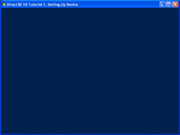
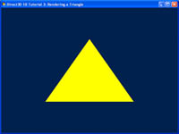
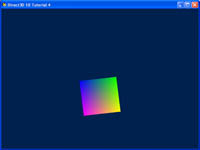
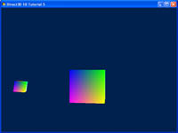
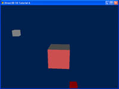
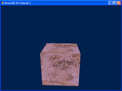

# Direct3D Tutorial Win32 Sample 
https://github.com/walbourn/directx-sdk-samples 

This is the DirectX SDK's Direct3D 11 tutorial series updated to use the Windows 10 SDK without any dependencies on legacy DirectX SDK content. These are tutorials for writing Win32 desktop DirectX 11.0 applications for Windows 10, Windows 8.1, Windows 8, and Windows 7. 

**This is based on the legacy DirectX SDK (June 2010) Win32 desktop tutorials. This is not intended for use with Windows Store apps, Windows RT, or universal Windows apps.**

### Description

Note that the original documentation pages still refer to legacy D3DX content such as `D3DX11CompileFromFile`, `D3DX11CreateShaderResourceViewFromFile`, and D3DX math which are not used in this version of the tutorials. 

Ideally you would avoid using runtime HLSL compilation entirely and use build-time compilation instead, loading only the 'shader binary blob' at runtime and using it directly with the Direct3D 11 API. For simplicity, these tutorials maintain the 'runtime' compilation mode using the Win32 desktop supported `D3DCompileFromFile` and the VC projects also compile the HLSL at build-time compilation.

These tutorials make use of [DirectXMath](https://walbourn.github.io/introducing-directxmath/) rather than XNAMath or D3DX math. 

For texture loading, the tutorials make use of the [DDSTextureLoader](https://walbourn.github.io/direct3d-11-textures-and-block-compression/) module. See [DirectXTK](https://github.com/Microsoft/DirectXTK) and [DirectXTex](https://github.com/Microsoft/DirectXTex). 

## Tutorial 1: Direct3D 11 Basics

In this first tutorial, we will go through the elements necessary to create a minimal Direct3D 11 application. Every Direct3D 11 application must have these elements to function properly. The elements include setting up a window and a device object, and then displaying a color on the window. 

http://msdn.microsoft.com/en-us/library/windows/apps/ff729718.aspx

_Note that rather than use D3D11CreateDeviceAndSwapChain as was the case in the original tutorial, this version now uses D3D11CreateDevice and then either DXGI 1.2's CreateSwapChainForHwnd or DXGI 1.1's CreateSwapChain. See this [blog post](https://walbourn.github.io/anatomy-of-direct3d-11-create-device/)._

## Tutorial 2: Rendering a Triangle

In the previous tutorial, we built a minimal Direct3D 11 application that outputs a single color to the window. In this tutorial, we will extend the application to render a single triangle on the screen. We will go through the process to set up the data structures associated with a triangle. 

The outcome of this tutorial is a window with a triangle rendered to the center of the window. 

http://msdn.microsoft.com/en-us/library/windows/apps/ff729719.aspx

_Note that rather than use the deprecated D3DX11 functions to compile the HLSL shader as was done in the original tutorial, this version uses the D3DCompile API directly._

## Tutorial 3: Shaders and Effect System

In the previous tutorial, we set up a vertex buffer and passed one triangle to the GPU. Now, we will actually step through the graphics pipeline and look at how each stage works. The concept of shaders and the effect system will be explained. 

Note that this tutorial shares the same source code as the previous one, but will emphasize a different section. 

http://msdn.microsoft.com/en-us/library/windows/apps/ff729720.aspx

## Tutorial 4: 3D Spaces

In the previous tutorial, we successfully rendered a triangle in the center of our application window. We haven't paid much attention to the vertex positions that we have picked in our vertex buffer. In this tutorial, we will delve into the 
details of 3D positions and transformation. 

The outcome of this tutorial will be a 3D object rendered to screen. Whereas previous tutorials focused on rendering a 2D object onto a 3D world, here we show a 3D object. 

 
http://msdn.microsoft.com/en-us/library/windows/apps/ff729721.aspx

## Tutorial 5: 3D Transformation

In the previous tutorial, we rendered a cube from model space to the screen. In this tutorial, we will extend the concept of transformations and demonstrate simple animation that can be achieved with these transformations. 

The outcome of this tutorial will be an object that orbits around another. It would be useful to demonstrate the ransformations and how they can be combined to achieve the desired effect. Future tutorials will be building on this foundation as we introduce new concepts. 

http://msdn.microsoft.com/en-us/library/windows/apps/ff729722.aspx

## Tutorial 6: Lighting

In the previous tutorials, the world looks boring because all the objects are lit in the same way. This tutorial will introduce the concept of simple lighting and how it can be applied. The technique used will be lambertian lighting. 

The outcome of this tutorial will modify the previous example to include a light source. This light source will be attached to the cube in orbit. The effects of the light can be seen on the center cube. 

 
http://msdn.microsoft.com/en-us/library/windows/apps/ff729723.aspx

## Tutorial 7: Texture Mapping and Constant Buffers

In the previous tutorial, we introduced lighting to our project. Now we will build on that by adding textures to our cube. Also, we will introduce the concept of constant buffers, and explain how you can use buffers to speed up processing by minimizing bandwidth usage. 

The purpose of this tutorial is to modify the center cube to have a texture mapped onto it. 

 
http://msdn.microsoft.com/en-us/library/windows/apps/ff729724.aspx 

Note rather than use the deprecated D3DX11 library to load the texture as was used in the original tutorial, this version uses the included DDSTextureLoader module.

### Dependencies

DirectX Win32 desktop samples typically make use of runtime HLSL compilation. Build-time compilation is recommended for all production Direct3D applications, but for experimentation and samples development runtime HLSL compilation is preferred. Therefore, the D3DCompile*.DLL must be available in the search path when these programs are executed. 

- When using the Windows 10 SDK and targeting Windows Vista or later, you can include the D3DCompile_47 DLL side-by-side with your application copying the file from the REDIST folder.  

`%ProgramFiles(x86)%\Windows kits\10\Redist\D3D\arm, x86 or x64 `

### More information

[Anatomy of Direct3D 11 Create Device](https://walbourn.github.io/anatomy-of-direct3d-11-create-device/)  
[Where is the DirectX SDK (2021 Edition)?](https://walbourn.github.io/anatomy-of-direct3d-11-create-device/)  
[DXUT for Win32 Desktop Update](https://walbourn.github.io/dxut-for-win32-desktop-update/)  
[Games for Windows and DirectX SDK blog](https://walbourn.github.io/)